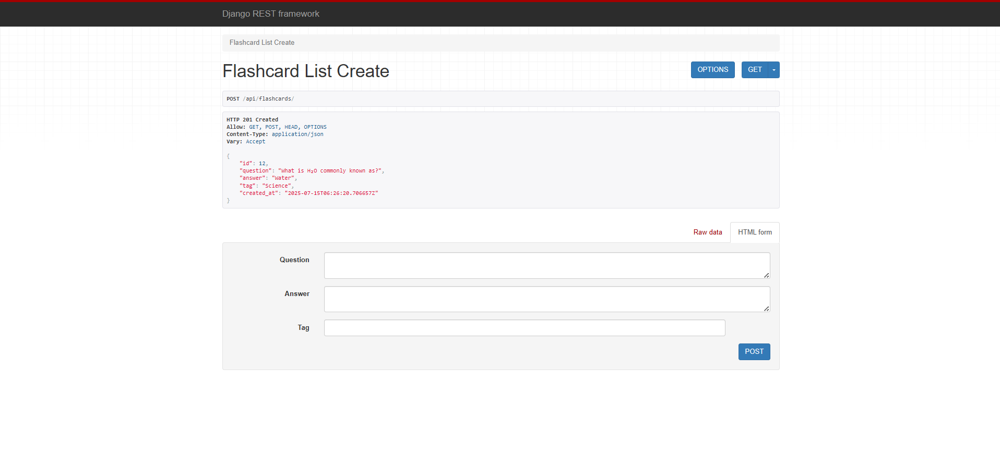
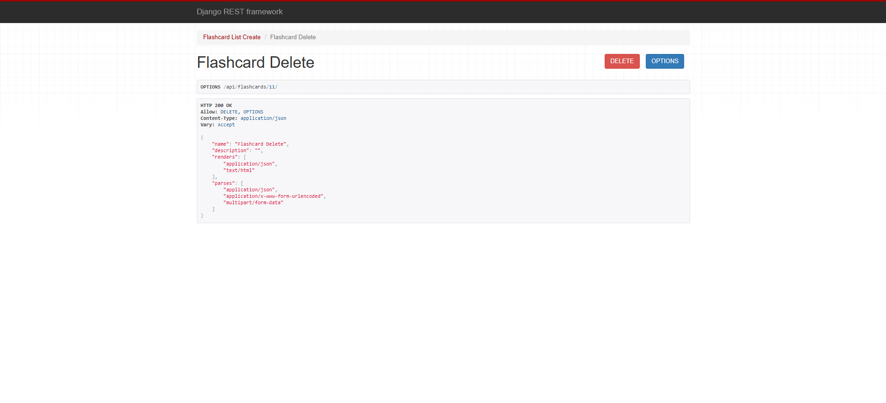

# Flashcard App

## DEMO

[Watch the demo video](https://raw.githubusercontent.com/yugalkaushik/assignment-prodinit/blob/main/assets/demo.mp4)

### APIs
Create flashcard

Delete Flashcard


### Backend Setup (Django)

```bash
cd backend
pip install -r requirements.txt
python manage.py migrate
python manage.py runserver
```

Backend runs on: http://localhost:8000

### Frontend Setup (Vue 3)

```bash
cd frontend
npm install
npm run dev
```

Frontend runs on: http://localhost:5173
